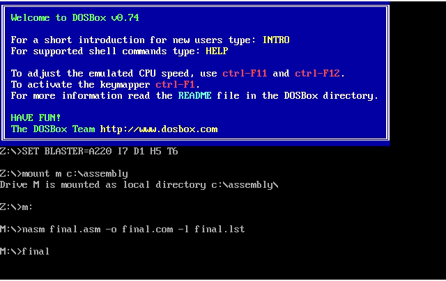
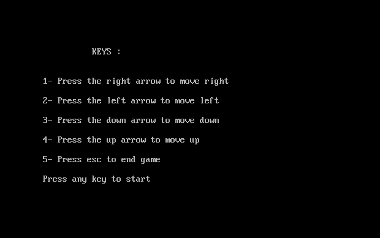
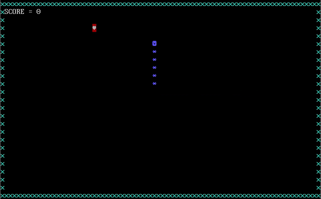
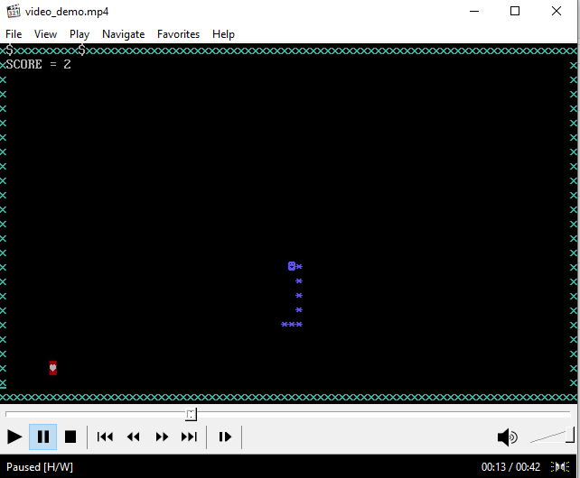

<h1 align="center">Hi 👋, I'm Marwa Shahid</h1>
<h3 align="center">A passionate Computer Science Student</h3>
<h3>What does this project do?</h3>

The project uses Assembly x86 to create a Snake game. Food randomly appears on the screen and the size of the snake and the score increases when it eats the food. Similarly, hurdles appear randomly on the screen and the snake dies when it hits the hurdle. Score is also displayed on the screen.

<h3 align="left">Languages and Tools used in this project:</h3>
<ul>
  <li>Assembly x86</li>
  <li>DOSBOX</li>
  <li>NASM</li>
</ul>
 
<h3>Demonstration:</h3>

 

- 👨‍💻 All of my projects are available at [https://github.com/marwashahid](https://github.com/marwashahid)

- 📝 I regularly write articles on [https://medium.com/](https://medium.com/)

- 📫 How to reach me **marvashahid09@gmail.com**

<h3 align="left">Connect with me:</h3>

